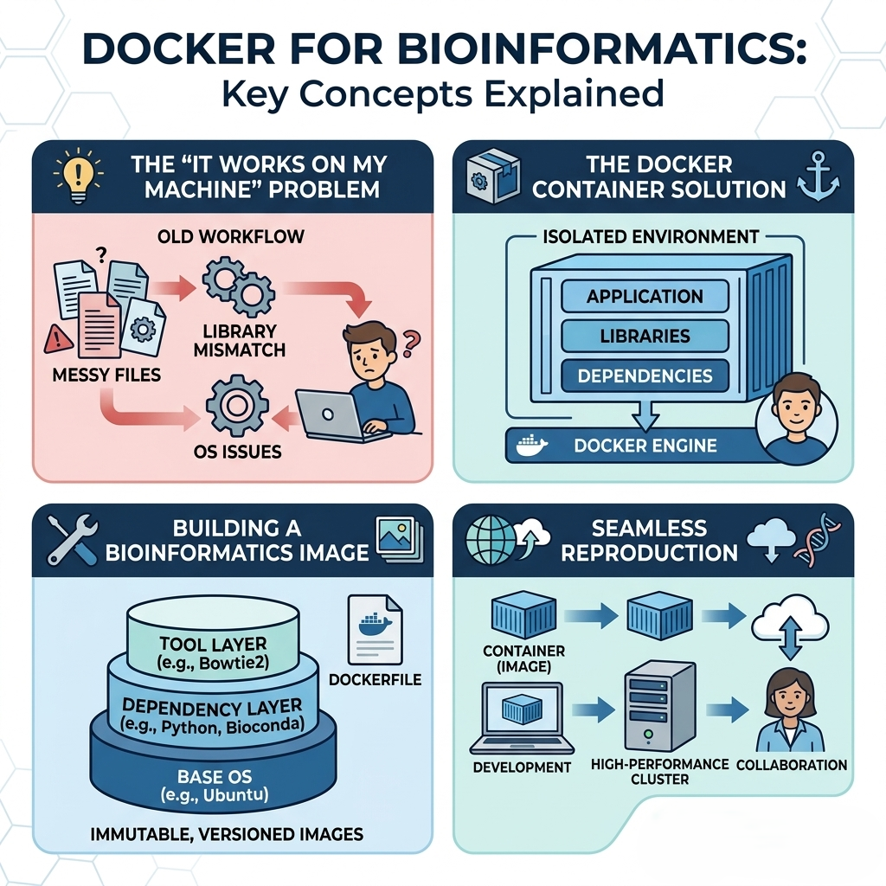

# NGS Variant Calling Workflow

This repository provides an end-to-end containerized environment for Next-Generation Sequencing (NGS) data analysis, specifically focusing on **Variant Calling** using the GATK (Genome Analysis Toolkit) best practices.

By utilizing **Docker** for containerization (and [Pixi](https://pixi.sh/) under the hood), this project guarantees reproducibility, ease of deployment, and a hassle-free setup of bioinformatics tools.

## 🛠️ Included Tools

The container is pre-configured with the standard variant calling stack:
- **Quality Control**: `fastqc`, `multiqc`
- **Read Trimming & Filtering**: `fastp`
- **Alignment**: `bwa`
- **BAM Manipulation**: `samtools`
- **VCF Manipulation**: `bcftools`
- **Metrics & Duplicates**: `picard`
- **Variant Calling**: `gatk4`

---

## 📂 Understanding the Project Files

When you clone this repository, you will see a few core files. Here is what they do:

- `README.md`: The file you are reading right now! It contains the documentation and instructions for the project.
- `Dockerfile`: The "recipe" that Docker uses to build your isolated container. It tells Docker to start with Ubuntu, install `pixi`, and copy your project files inside. *(See the "For Students" section at the bottom for a line-by-line breakdown!)*
- `pixi.toml`: The configuration file for the Pixi package manager. This is where we list all the bioinformatics tools we want to use (like `bwa`, `samtools`, `gatk4`) and their specific versions. 
- `pixi.lock`: A generated file that locks down the *exact* versions of every single sub-dependency. This ensures that the environment builds exactly the same way every time, completely eliminating the "it works on my machine" problem.

---

## 🚀 Step-by-Step Guide for Beginners

Follow these steps to clone the repository, set up your environment, and run a complete Variant Calling pipeline.

### Step 1: Get the Code (Clone the Repository)
First, you need to download this project to your computer. Open your terminal (or Command Prompt/PowerShell on Windows) and run:

```bash
git clone https://github.com/deepbioacademy/ngs_workflow.git
cd ngs_workflow
```

### Step 2: Understand and Install Docker



Bioinformatics tools often have complex dependencies. Installing them directly on your computer can cause conflicts and errors. 

**Docker** solves this by creating a "Container"—a lightweight, standalone, and completely isolated mini-computer running inside your actual computer. 
- **What it does:** It packages all our necessary tools into a single blueprint called an **Image** (defined by the `Dockerfile`). 
- **Why it's great:** When you start a **Container** from this Image, you get an environment that works exactly the same way on every machine. No installation headaches!

**Installation:**
Before you begin, install Docker Desktop on your machine:
- **Windows / Mac:** Download and install [Docker Desktop](https://www.docker.com/products/docker-desktop/).
- **Linux:** Follow the instructions for [Docker Engine](https://docs.docker.com/engine/install/).

Once installed, open Docker Desktop and make sure it is running. Verify it in your terminal: `docker --version`.

### Step 3: Setup (Build the Docker Image)
Think of this step as downloading and installing all the bioinformatics tools into your isolated mini-computer. You only need to do this once.

Make sure you are inside the `ngs_workflow` folder, then run:
```bash
docker build -t ngs-workflow .
```
**What does this command mean?**
- `docker build`: Create a new image.
- `-t ngs-workflow`: Name (tag) our image "ngs-workflow".
- `.`: Look in the *current* folder for the setup instructions.

### Step 4: Execution (Run the Container)
Now we start the Container and "mount" (connect) our local folders so the tools inside can read our raw data and save results to our actual computer.

Run the following command:
```bash
docker run -it \
  -v $(pwd)/data:/workspace/data \
  -v $(pwd)/results:/workspace/results \
  ngs-workflow
```
*(Windows Users: Replace `$(pwd)` with `%cd%` in Command Prompt, or `${PWD}` in PowerShell).*

**You are now inside the Docker container!** Your terminal prompt will change, and every tool is ready to be used.

---

## 🧬 Step 5: Run the Variant Calling Pipeline

Now that you are inside the container, let's run a complete analysis. We will use sample data from the 1000 Genomes Project.

### 5.1 Prepare Directories and Download Data
Before running the tools, we need to create the required output folders and download our sample data.
```bash
# Create all necessary folders
mkdir -p data/raw data/reference results/qc results/trimmed results/alignment results/variants results/multiqc

# Download sample data
cd data/raw

curl -O ftp://ftp-trace.ncbi.nih.gov/1000genomes/ftp/phase3/data/HG00096/sequence_read/SRR062634_1.filt.fastq.gz
curl -O ftp://ftp-trace.ncbi.nih.gov/1000genomes/ftp/phase3/data/HG00096/sequence_read/SRR062634_2.filt.fastq.gz
```

### 5.2 Quality Control & Trimming
Evaluate the quality of your raw reads, trim adapters, and re-evaluate the trimmed reads.
- **`fastqc`**: Analyzes sequence data and generates an HTML report detailing read quality. We run this *before* and *after* trimming to see the improvement.
  - `-o`: Specifies the output directory to save the HTML and ZIP reports.
- **`fastp`**: Automatically filters out low-quality reads and trims adapter sequences so they don't interfere with alignment.
  - `-i` / `-I`: The input Forward (R1) and Reverse (R2) FASTQ files.
  - `-o` / `-O`: The output (trimmed) Forward and Reverse FASTQ files.
  - `--json` / `--html`: Saves the fastp quality reports in JSON and HTML formats so MultiQC can read them.
- **`multiqc`**: Scans the `results/qc/` directory and aggregates all FastQC and fastp reports into a single, easy-to-read dashboard.
  - `-o`: Specifies the output directory for the final MultiQC dashboard.

```bash
# 1. Run FastQC on raw data (Before Trimming)
fastqc data/raw/SRR062634_1.filt.fastq.gz data/raw/SRR062634_2.filt.fastq.gz -o results/qc/

# 2. Trim reads with fastp (and save reports to qc folder)
fastp -i data/raw/SRR062634_1.filt.fastq.gz -I data/raw/SRR062634_2.filt.fastq.gz \
      -o results/trimmed/SRR062634_1_trimmed.fastq.gz -O results/trimmed/SRR062634_2_trimmed.fastq.gz \
      --json results/qc/fastp.json --html results/qc/fastp.html

# 3. Run FastQC on trimmed data (After Trimming)
fastqc results/trimmed/SRR062634_1_trimmed.fastq.gz results/trimmed/SRR062634_2_trimmed.fastq.gz -o results/qc/

# 4. Generate a combined report with MultiQC
multiqc results/qc/ -o results/multiqc/
```

### 5.3 Reference Genome Indexing
Before alignment, index your reference genome (only needs to be done once per reference).
*(Make sure you have a reference genome `ref.fa` in `data/reference/` before running this)*.
- **`bwa index`**: Creates an FM-index for the Burrows-Wheeler Aligner, enabling fast mapping.
- **`gatk CreateSequenceDictionary`**: Creates a `.dict` file containing contig names and lengths, required by GATK.
- **`samtools faidx`**: Creates a `.fai` index, allowing quick extraction of any sequence from the reference.


```bash 
# Download refernece genome 
cd data/reference/
curl -O https://hgdownload.soe.ucsc.edu/goldenPath/hg38/bigZips/hg38.fa.gz
gunzip hg38.fa.gz
```

```bash
# Index with BWA
bwa index data/reference/ref.fa

# Create sequence dictionary for GATK
gatk CreateSequenceDictionary -R data/reference/ref.fa

# Create samtools index
samtools faidx data/reference/ref.fa
```

### 5.4 Alignment
Align the trimmed reads to the reference genome.
- **`bwa mem`**: The algorithm that maps our short reads to the reference genome.
  - `-t 4`: Uses 4 CPU threads to speed up the alignment process.
  - `-R`: Adds "Read Group" information (e.g., `SM` for Sample Name, `PL` for Platform). This is strictly required by GATK for downstream processing!
  - `>`: A bash redirect that saves the console output into a `.sam` file instead of printing it to the screen.
```bash
bwa mem -t 4 -R "@RG\tID:SRR062634\tSM:HG00096\tPL:ILLUMINA" \
    data/reference/ref.fa \
    results/trimmed/SRR062634_1_trimmed.fastq.gz \
    results/trimmed/SRR062634_2_trimmed.fastq.gz > results/alignment/SRR062634.sam
```

### 5.5 BAM Conversion & Sorting
Convert SAM to BAM and sort it.
- **`samtools view`**: A tool to read and convert SAM/BAM files.
  - `-S`: Tells samtools the input is a SAM file.
  - `-b`: Tells samtools to output a BAM file.
- **`samtools sort`**: Sorts the reads by their coordinate position on the genome (required for variant calling).
  - `-o`: Specifies the output filename for the sorted BAM file.
- **`samtools index`**: Creates a `.bai` index so tools can randomly access the BAM file quickly.
```bash
samtools view -Sb results/alignment/SRR062634.sam | samtools sort -o results/alignment/SRR062634_sorted.bam
samtools index results/alignment/SRR062634_sorted.bam
```

### 5.6 Mark Duplicates (GATK / Picard)
Mark PCR duplicates so they don't skew variant calling.
- **`gatk MarkDuplicates`**: Identifies read pairs that likely originated from a single DNA molecule (PCR duplicates) and flags them so they are ignored by the variant caller. This prevents false positive variant calls caused by amplification biases.
  - `-I`: The input sorted BAM file.
  - `-O`: The output BAM file with duplicates marked.
  - `-M`: A required text file where GATK will save metrics/statistics about the duplicates it found.
```bash
gatk MarkDuplicates \
    -I results/alignment/SRR062634_sorted.bam \
    -O results/alignment/SRR062634_marked_dup.bam \
    -M results/alignment/marked_dup_metrics.txt

samtools index results/alignment/SRR062634_marked_dup.bam
```

### 5.7 Variant Calling (HaplotypeCaller)
Finally, call variants using GATK HaplotypeCaller.
- **`gatk HaplotypeCaller`**: The core tool that actually identifies SNPs (Single Nucleotide Polymorphisms) and Indels (Insertions/Deletions) by assembling haplotypes in active regions. It outputs a VCF (Variant Call Format) file containing all identified mutations.
  - `-R`: The reference genome FASTA file.
  - `-I`: The input BAM file (after sorting and duplicate marking).
  - `-O`: The output VCF file where the final variants will be saved.
```bash
gatk HaplotypeCaller \
    -R data/reference/ref.fa \
    -I results/alignment/SRR062634_marked_dup.bam \
    -O results/variants/SRR062634_raw_variants.vcf
```

---

## 📦 Alternative: Managing Dependencies with Pixi (No Docker)

If you prefer not to use Docker, you can install the tools directly on your system using [Pixi](https://pixi.sh/):

1. Install Pixi: `curl -fsSL https://pixi.sh/install.sh | bash`
2. Install tools: `pixi install` (Run this inside the `ngs_workflow` folder)
3. Enter the environment: `pixi shell`

All dependencies are defined in `pixi.toml`.

---

## 🎓 For Students: How We Created This Docker Container

If you are learning how to build your own Docker containers, here is a step-by-step breakdown of how we created the `Dockerfile` for this project. 

The `Dockerfile` is essentially a recipe. Docker reads this recipe from top to bottom to build the image.

### 1. The Base Image
```dockerfile
FROM ubuntu:22.04
```
Every Dockerfile must start with a `FROM` instruction. This tells Docker what operating system to start with. We are using a clean, bare-bones Ubuntu Linux system.

### 2. System Settings & Dependencies
```dockerfile
ENV DEBIAN_FRONTEND=noninteractive

RUN apt-get update && apt-get install -y \
    curl \
    ca-certificates \
    && rm -rf /var/lib/apt/lists/*
```
- `ENV`: Sets an environment variable. We set `DEBIAN_FRONTEND` to `noninteractive` so that Ubuntu doesn't ask us any "Yes/No" prompts while installing software (since no human is there to click "Yes" during the build process).
- `RUN`: Executes a command inside the container. We use the `apt-get` package manager to update the system and install `curl` (a tool to download things from the internet).

### 3. Installing Our Package Manager (Pixi)
```dockerfile
RUN curl -fsSL https://pixi.sh/install.sh | bash
ENV PATH="/root/.pixi/bin:${PATH}"
```
We use `curl` to download and run the installation script for **Pixi**. Then, we update the system's `PATH` so that the computer knows where to find the `pixi` command.

### 4. Setting Up the Workspace
```dockerfile
WORKDIR /workspace
```
`WORKDIR` creates a folder named `/workspace` inside the container and navigates into it (like running `mkdir /workspace` and then `cd /workspace`). Everything we do from now on happens inside this folder.

### 5. Copying Files and Installing Bioinformatics Tools
```dockerfile
COPY pixi.toml pixi.lock* ./
RUN pixi install
COPY . .
```
- `COPY`: Takes files from your *actual* computer and copies them into the container. We first copy `pixi.toml` (which lists `bwa`, `gatk4`, etc.).
- `RUN pixi install`: This tells Pixi to read the `.toml` file and download all the bioinformatics tools. 
- `COPY . .`: Finally, we copy the rest of our project files (like scripts or READMEs) into the container. *(We do this in two steps to make rebuilding the image faster! If we only change a script, Docker doesn't have to re-download the heavy bioinformatics tools).*

### 6. Defining How the Container Starts
```dockerfile
ENTRYPOINT ["pixi", "run"]
CMD ["bash"]
```
- `ENTRYPOINT`: This is the main command that runs when the container starts. We set it to `pixi run`, meaning everything executed in this container will automatically use the Pixi environment where our tools are installed.
- `CMD`: This provides the default argument to the Entrypoint. If the user just runs `docker run ngs-workflow`, it will execute `pixi run bash`, dropping them into an interactive terminal!
